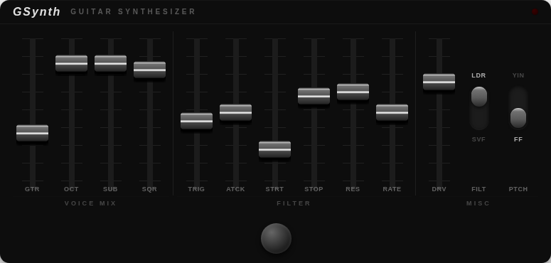

# GSynth



GSynth is a **guitar synthesizer** effect: it tracks your guitar and drives a
swept resonant filter from a stack of synth voices — dry guitar, an octave-down
and two-octaves-down divider, and a square (pitch) voice — shaped by an
envelope follower and a trigger.

Two filter models (state-variable / Moog ladder), two voicing modes (flip-flop
dividers / YIN pitch tracking), and a FET-style input drive.

- **LV2** — Linux desktop, MOD Audio, Raspberry Pi...
- **VST3 / AU / Standalone** — macOS (universal) and Windows, via JUCE

The DSP core (`src/gsynth_dsp.{c,h}`) is shared by every build; only the host
wrapper differs.

---

## Build LV2 (Linux desktop)

Requires `pkg-config` and the LV2 headers (`lv2-dev`).

```sh
make                       # produces gsynth.lv2/gsynth.so
sudo make install          # installs to /usr/local/lib/lv2/gsynth.lv2
```

Set `WITH_MODGUI=0` to install without the (optional) MOD GUI.

---

## Build for MOD with mod-plugin-builder

With a [mod-plugin-builder](https://github.com/mod-audio/mod-plugin-builder)
environment in place, copy the provided recipe from
`plugins/packages/gsynth/` to `mod-plugin-builder/plugins/package/gsynth`.

```sh
# From the mod-plugin-builder root
./build <platform> gsynth

# Examples:
./build moddwarf-new gsynth          # MOD Dwarf
./build modduox-new  gsynth          # Duo X / Raspberry Pi
```

The recipe pins the source revision via `GSYNTH_VERSION`; bump it to the latest
commit after a significant change.

---

## Build VST3 / AU / Standalone (macOS and Windows)

JUCE project in `juce/`. JUCE is downloaded automatically (FetchContent).
Requires CMake ≥ 3.22 and a C++17 toolchain.

```sh
cmake -B juce/build -S juce -DCMAKE_BUILD_TYPE=Release
cmake --build juce/build --config Release --parallel
```

The binaries land in `juce/build/GSynth_artefacts/Release/`
(`AU/`, `VST3/`, `Standalone/`). By default they are also copied into your
user plug-in folders; pass `-DGSYNTH_COPY_AFTER_BUILD=OFF` for CI/packaging.

### macOS

The build is **universal** (arm64 + x86_64) by default. Validate the AU with
`auval -v aufx Gsyn Plli`.

```sh
cmake -B juce/build -S juce -DCMAKE_BUILD_TYPE=Release \
      -DCMAKE_OSX_ARCHITECTURES="arm64;x86_64"
cmake --build juce/build --config Release --parallel
```

### Windows

Same command, VST3 + Standalone (`.exe`):

```sh
cmake -B juce/build -S juce -DCMAKE_BUILD_TYPE=Release
cmake --build juce/build --config Release --parallel
```

### Linux

A GUI build needs the usual JUCE system packages, e.g. on Debian/Ubuntu:

```sh
sudo apt install libasound2-dev libfreetype-dev libx11-dev libxext-dev \
                 libxinerama-dev libxrandr-dev libxcursor-dev libgl1-mesa-dev
```

See `juce/README.md` for more details on the JUCE build.

## License

MIT.
